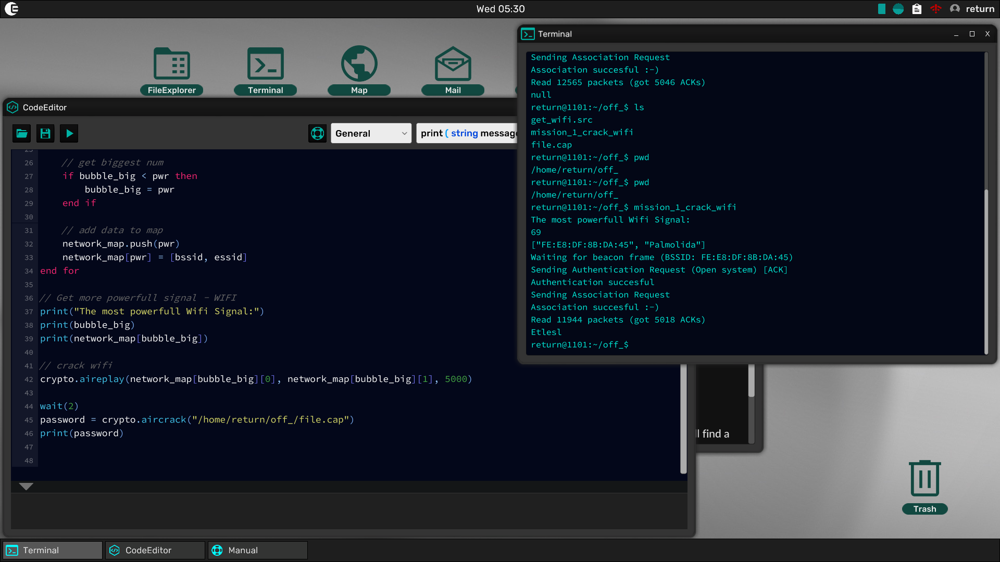

# GreyHack WiFi Hacking Script

## Description
This script automates the process of hacking a WiFi network in GreyHack by:
1. Enabling monitor mode on the wireless interface
2. Scanning for available WiFi networks
3. Selecting the network with the strongest signal
4. Capturing handshake packets
5. Cracking the password

## Steps to Hack WiFi in GreyHack

### 1. Enable Monitor Mode
```src
crypto = include_lib("/lib/crypto.so")
crypto.airmon("start", "wlan0")
```
This command puts the wireless adapter into monitor mode, allowing it to capture network traffic.

### 2. Scan for WiFi Networks
```src
computer = get_shell.host_computer
networks = computer.wifi_networks("wlan0")
```
Retrieves a list of available WiFi networks.

### 3. Select the Strongest Signal
```src
network_map = {}
bubble_big = 0

for network in networks
    data = network.split(" ")
    bssid = data[0]
    essid = data[-1]
    pwr = data[1]
    pwr = pwr.replace("%", "").to_int

    if bubble_big < pwr then
        bubble_big = pwr
    end if
    
    network_map.push(pwr)
    network_map[pwr] = [bssid, essid]
end for

print("The most powerful WiFi Signal:")
print(bubble_big)
print(network_map[bubble_big])
```
This loop scans all detected WiFi networks and selects the one with the highest signal strength.

### 4. Capture Handshake Packets
```src
crypto.aireplay(network_map[bubble_big][0], network_map[bubble_big][1], 5000)
wait(2)
```
Captures handshake packets needed for password cracking.

### 5. Crack the WiFi Password
```src
password = crypto.aircrack("/home/return/off_/file.cap")
print(password)
```
Uses the captured packets to attempt password cracking.

## Screenshot


## Notes
- This script automates the WiFi hacking process.
- The `aireplay` function is used to deauthenticate clients and capture handshake packets.
- The `aircrack` function attempts to crack the password from the captured handshake.

**Use this knowledge responsibly!**

